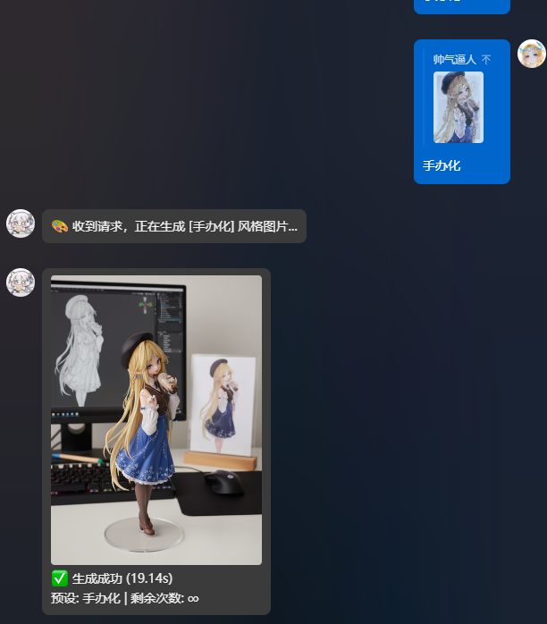
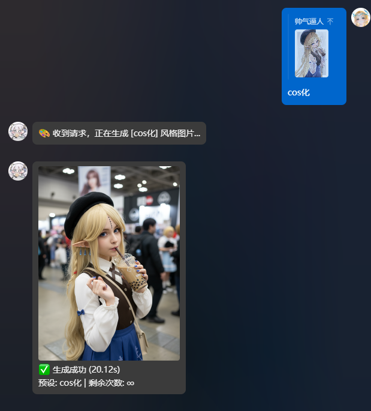
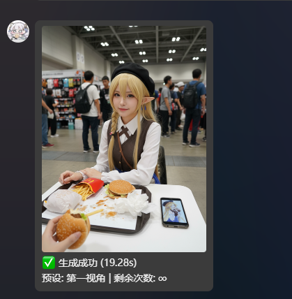
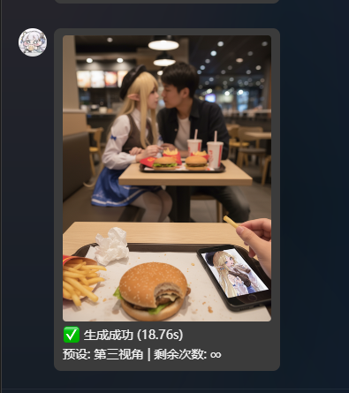

# 图像生成插件

适配多种图像生成模型，支持图生图和文生图，可自定义预设指令。

## 功能特性

- **多API支持**：支持多个 API 服务商（硅基流动、智谱 AI、OpenAI-responses、Flow2API、Vertex AI (Google) 等），可随意切换。
- **智能重试机制**：内置自动退避重试策略，遇到 API 限制 (429) 或网络波动时自动重试；若配置了多个 Key，会自动轮换 Key 尝试，最大程度保证生图成功率。
- **免费接口支持**：新增 **Vertex_AI_Anonymous** 接口，基于 Google Gemini 模型，无需 API Key 即可免费使用（需配置反代或确保网络通畅）。
- **LLM 函数调用**：支持 AstrBot 的函数调用（Function Calling）机制。开启后，机器人可以理解自然语言对话，智能判断是否需要画图，并自动调用插件生成图片，无需用户手动输入指令。
- **多风格转换**：内置几十种指令，如 `#手办化`、`#Q版化`、`#痛车化`、`#鬼图` 等，满足不同场景需求。
- **自定义生成**：使用 `图生图 <提示词>` 指令（前缀可自定义），可以完全自定义 Prompt 进行创作。
- **文生图支持**：新增 `#文生图` 指令，支持纯文本描述直接生成图像。
- **灵活的输入方式**：支持直接发送图片、回复图片、或`@用户`来使用其头像进行制作。
- **强大的管理功能 (管理员限定)**：
  - **Key 管理**：通过指令动态添加、查看、删除 API Key，支持配置多个 Key 并自动轮换使用。
  - **用户次数管理**：可为普通用户设置使用次数，并通过指令进行增加和查询，实现轻量级付费或激励机制。
- **高度可定制**：所有指令的默认提示词（Prompt）都在后台配置文件中开放，可随时按自己的喜好进行微调。
- **代理支持**：内置网络代理支持，方便在特殊网络环境下部署。

## 安装与配置

### 安装

1.  将该文件夹放入 `astrbot/plugins` 目录下。
2.  重启 AstrBot。

### 配置

在 AstrBot 管理面板的 `插件管理` 中进行配置。

| 配置项             | 类型   | 描述                                                                                                                              |
| ------------------ | ------ | --------------------------------------------------------------------------------------------------------------------------------- |
| `api_from`         | 字符串 | **API 来源选择**，可选值：`siliconflow`、`bigmodel`、`OpenAI-responses`、`Flow2API`、`Vertex_AI_Anonymous`。                                                      |
| `api_url`          | 字符串 | **(必需)** API 的请求地址。Vertex_AI_Anonymous 可留空。                                                                                                       |
| `model`            | 字符串 | **(必需)** 图生图和文生图使用的默认模型名称。                                                                                      |
| `api_keys`         | 列表   | **(必需)** 你的 API 密钥。可以通过 `#画图添加key` 指令管理，支持多个 Key。Vertex_AI_Anonymous 无需填写。                                                             |
| `vertex_ai_system_prompt` | 文本 | **【VertexAI】系统提示词**，仅对 Vertex_AI_Anonymous 有效。可以指导模型生成特定风格的图片。 |
| `provider_max_retry` | 整数 | **【通用】当前提供商最大重试次数**，默认为 3。适用于所有 API 提供商。请求失败时会自动进行随机退避重试，若配置了多个 Key 也会自动轮换。 |
| `recaptcha_base_api` | 字符串 | **【VertexAI】Recaptcha Base API**，默认为 `https://www.google.com`。若国内网络不通，可配置反代。 |
| `vertex_ai_base_api` | 字符串 | **【VertexAI】Vertex AI Base API**，默认为 `https://cloudconsole-pa.clients6.google.com`。若国内网络不通，可配置反代。 |
| `vertex_ai_impersonate_list` | 列表 | **【VertexAI】浏览器指纹列表**，默认为 `["chrome131", ...]`。每次请求会按顺序轮换使用，以规避风控。 |
| `vertex_ai_verbose_logging` | 开关 | **【VertexAI】显示详细请求信息**，默认为 `True`。开启后会在日志中输出当前使用的指纹和会话状态。 |
| `vertex_ai_image_size` | 字符串 | **【VertexAI】生图清晰度**，可选值：`1K`、`2K`、`4K`、`智能匹配`。'智能匹配'将优先匹配提示词中的 1K/2K/4K。 |
| `llm_tool_description` | 字符串 | **函数工具描述**，自定义 LLM 调用此工具时的功能介绍。用于引导 LLM 何时调用画图功能。 |
| `llm_prompt_description` | 字符串 | **生图提示词扩充指南**，当 LLM 决定调用工具时，指导其如何构造最终 Prompt。建议使用英文。 |
| `api_timeout`      | 整数   | **API 请求超时 (秒)**，默认为 `300`。                                                                                             |
| `download_timeout` | 整数   | **图片下载超时 (秒)**，默认为 `60`。                                                                                              |
| `rate_limit_seconds` | 整数 | **全局调用频率限制 (秒)**，默认为 `120`。规定插件在两次生图API调用之间必须等待的时间。管理员无视此限制。                                 |
| `prefix`           | 开关   | 是否要求指令必须带前缀（如 `#`）或 @机器人。推荐开启。                                                                             |
| `extra_prefix`     | 字符串 | 自定义图生图提示词模式的前缀，用于触发自定义 Prompt（默认为 `图生图`）。                                                                    |
| `use_proxy`        | 开关   | 是否为插件启用网络代理。                                                                                                          |
| `proxy_url`        | 字符串 | 代理服务器地址，例如 `http://127.0.0.1:7890`。                                                                                    |
| `user_whitelist`   | 列表   | **用户白名单**，留空则不限制。                                                                                                    |
| `user_blacklist`   | 列表   | **用户黑名单**，优先级最高。                                                                                                      |
| `group_whitelist`  | 列表   | **群聊白名单**，留空则不限制。                                                                                                    |
| `group_blacklist`  | 列表   | **群聊黑名单**，优先级最高。                                                                                                      |
| `prompt_list`      | 列表   | **(核心)** 在这里自定义所有指令的生成提示词。格式为 `触发词:提示词`。                                                               |
| `enable_user_limit` | 开关   | 是否启用用户次数限制。                                                                                                            |
| `user_daily_fixed_quota` | 整数   | **每用户每日固定额度**，默认为 `0`。每天0点刷新，与管理员给予或签到获得的永久次数叠加。                                                  |
| `enable_group_limit`    | 开关   | 是否启用群组次数限制。                                                                                                            |
| `group_daily_fixed_quota` | 整数   | **每群组每日固定额度**，默认为 `0`。每天0点刷新，与管理员给予的永久次数叠加。                                                       |
| `enable_checkin`        | 开关   | 是否开启每日签到功能。                                                                                                            |
| `enable_random_checkin` | 开关   | **是否开启随机签到奖励**，开启后奖励在1到最大值之间随机。                                                                            |
| `checkin_fixed_reward`  | 整数   | **固定签到奖励次数**，随机签到关闭时生效。                                                                                          |
| `checkin_random_reward_max` | 整数 | **随机签到奖励最大值**，随机签到开启时生效。                                                                                      |

## 使用方法

### 智能画图 (LLM Function Calling)

如果你的 AstrBot 配置了支持 Function Calling 的 LLM（如 GPT-4, Claude 3 等），你可以直接在对话中让机器人画图，例如：
- "帮我画一只可爱的小猫"
- "把这张图变成手办风格"（需引用图片）

机器人会智能判断并调用插件进行生成。

### 图生图

- **发送图片**并使用命令。
- **引用**含有图片的消息并使用命令。
- **@某人**并使用命令 (将使用该用户的头像)。

### 文生图

使用 `#文生图 <描述>` 指令直接根据文字描述生成图像。

---
## 📖 命令列表

### 基础命令

| 命令 | 功能说明 |
| :--- | :--- |
| `#手办化` | 生成角色的手办造型，偏向立体模型展示 |
| `#手办化2` | 生成另一种风格的手办造型 |
| `#手办化3` | 生成带包装盒的贩售风格手办 |
| `#手办化4` | 生成玻璃柜中展示的典藏风格手办 |
| `#手办化5` | 生成写实感更强的PVC手办 |
| `#手办化6` | 生成带包装和书籍的收藏级手办 |
| `#Q版化` | 生成Q版（可爱简化比例）的角色形象 |
| `#cos化` | 生成角色cosplay化的照片风格 |
| `#cos自拍` | 生成角色第一人称自拍风格的cos照片 |
| `#痛屋化` | 生成痛屋（贴满角色元素装饰的房间）场景 |
| `#痛屋化2` | 生成另一种风格的痛屋 |
| `#痛车化` | 生成痛车（贴有角色图案的车辆）造型 |
| `#孤独的我` | 生成孤独、滑稽或小丑化的意境图 |
| `#第一视角` | 生成第一人称视角场景，沉浸感强 |
| `#第三视角` | 生成第三人称视角场景，看起来像他人在看角色 |
| `#鬼图` | 生成灵异鬼图风格照片，带恐怖氛围 |
| `#贴纸化` | 生成创意拼贴画艺术风格 |
| `#玉足` | 生成角色玉足相关的画面或细节 |
| `#玩偶化` | 生成毛绒玩偶（fumo）风格角色 |
| `#cos相遇` | 生成漫画角色与coser相遇的场景 |
| `#三视图` | 生成角色三视图（正面、侧面、背面） |
| `#穿搭拆解` | 生成角色服装穿搭的详细拆解图 |
| `#拆解图` | 生成模型拆解或零件展示图 |
| `#角色界面` | 生成类似游戏中角色信息界面的画面 |
| `#角色设定` | 生成角色设定图，包含全身、武器、细节等 |
| `#3D打印` | 生成适合3D打印的模型预览图 |
| `#微型化` | 生成微缩模型、小比例角色形象 |
| `#挂件化` | 生成挂件、钥匙扣风格的角色造型 |
| `#写真集` | 生成角色不同姿势的写真集 |
| `#高清修复` | 对画面进行高清化、细节修复 |
| `#人物转身` | 生成人物转身动作的连续画面 |
| `#绘画四宫格` | 生成四宫格绘画对比图或进度展示 |
| `#发型九宫格` | 生成九种不同发型的对比图 |
| `#头像九宫格` | 生成九个不同风格的头像合集 |
| `#表情九宫格` | 生成角色九种不同表情合集 |
| `#多机位` | 生成多机位拍摄的场景视角合集 |
| `#电影分镜` | 生成电影风格的分镜图 |
| `#动漫分镜` | 生成动漫风格的分镜图 |
| `#真人化` | 生成角色的真人化形象 |
| `#真人化2` | 升级版，完美复刻原图，同时实现更强的真人感 |
| `#半真人` | 生成半写实半动漫的混合风格 |
| `#半融合` | 生成角色与其他元素融合的半融合风格 |
| `#卡通信息图` | 根据内容生成卡通手绘风格的信息图 |
| `#夜总会照片` | 生成手机偷拍风格的夜总会/KTV照片 |
| `#玉足2` | 升级版，生成另一种风格的玉足特写 |
| `#拍照解题` | 手写风格解答图片中的问题 |
| `#下蹲吐舌` | 生成角色下蹲并吐舌的俏皮动作 |
| `#电影分镜2` | 生成另一种风格的电影分镜图 |
| `#表情包` | 生成 5x5 布局的 LINE 风格表情包，带手写中文标注 |
| `#时光机` | 生成角色从出生到 80 岁不同阶段的照片合集 |
| `#漫画说明` | 以漫画形式延伸说明或科普参考图中的内容 |
| `#圣诞礼物` | 生成角色蜷缩在巨大圣诞礼盒内的写真摄影 |

### 自定义与查询

| 命令 | 功能说明 |
| :--- | :--- |
| `图生图 <提示词>` | 使用自定义提示词进行图生图（前缀取决于 `extra_prefix` 配置） |
| `#文生图 <描述>` | 使用文字描述直接生成图像 |
| `#画图帮助` / `#lm帮助` | 查询预设指令列表 |
| `#画图帮助 <预设名>` | 查看指定预设的 Prompt 内容 |
| `#画图查询次数` | 查询自己的剩余次数 |
| `#画图签到` | 进行每日签到获取次数 (奖励为永久次数) |

### 👑 管理命令 (仅主人)

| 命令 | 功能说明 |
| :--- | :--- |
| `#画图添加模板 <触发词>:<提示词>` | 添加或更新预设指令 (别名: `#lma`, `#lm添加`) |
| `#画图添加key <key1>...` | 添加一个或多个 API 密钥 |
| `#画图key列表` | 查看 API 密钥列表 |
| `#画图删除key <序号\|all>` | 删除 API 密钥 |
| `#画图增加用户次数 @用户 <次数>` | 为用户增加 **永久** 使用次数 |
| `#画图增加群组次数 <群号> <次数>` | 为群组增加 **永久** 使用次数 |

---

## 🎨 效果展示

*以下图片均为插件实际生成效果。*

| `#手办化` | `#cos化` |
| :---: | :---: |
|  |  |
| **#第一视角** | **#第三视角** |
|  |  |

## 致谢
修改自[shskjw/astrbot_plugin_siliconflow-shouban](https://github.com/shskjw/astrbot_plugin_siliconflow-shouban)